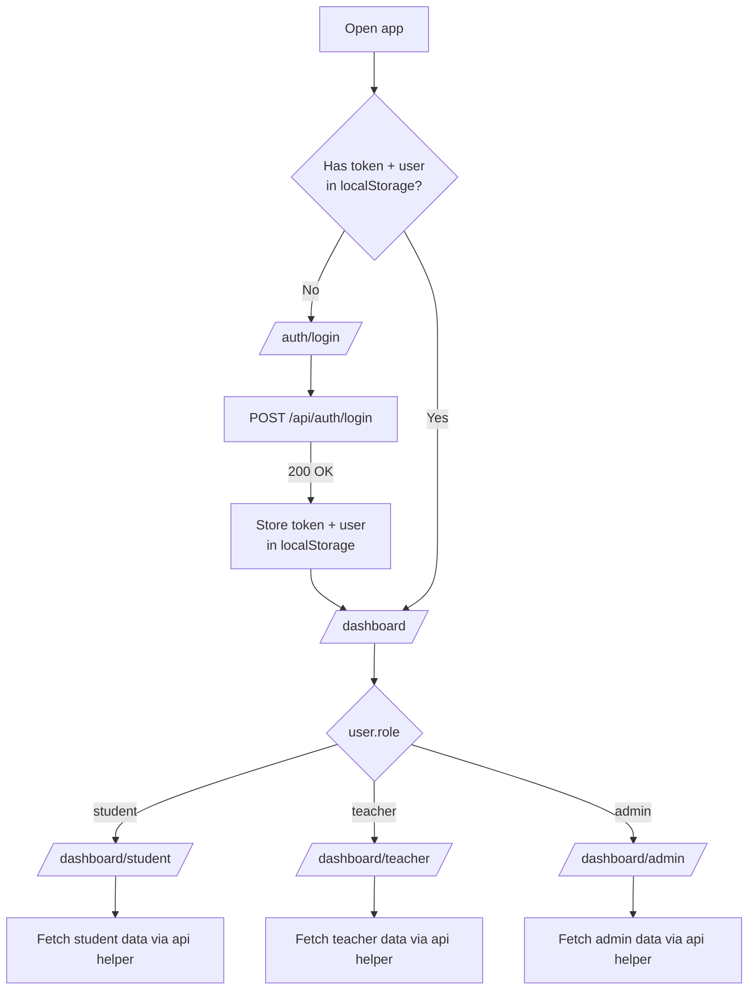
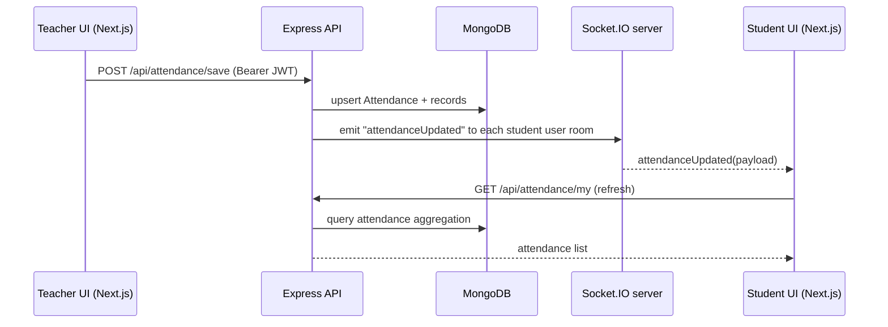

# EduDash — Project Workflow & Flowcharts

This repo is a small “monorepo”:
- `frontend/`: Next.js (App Router) UI
- `backend/`: Express + MongoDB API (+ Socket.IO for real-time updates)

## 1) Development workflow (local)

### Install
From repo root:
- `npm run install:all`

### Configure env
Backend (create `backend/.env`):
- `MONGODB_URI=...`
- `JWT_SECRET=...`
- `PORT=6000` (optional; defaults to `6000` per `backend/src/server.ts`)

Frontend (set in `frontend/.env.local` or your shell):
- `NEXT_PUBLIC_API_URL=http://localhost:6000`
- `NEXT_PUBLIC_SOCKET_URL=http://localhost:6000` (optional; falls back to `NEXT_PUBLIC_API_URL`)

### Run
From repo root:
- `npm run dev` (runs frontend + backend concurrently)

Frontend:
- `http://localhost:3000`

Backend:
- `http://localhost:6000` (unless overridden by `PORT`)

## 2) Runtime architecture (high-level)

```mermaid
flowchart LR
  user[User Browser]
  next[Next.js Frontend\nfrontend/ (port 3000)]
  api[Express API\nbackend/src/server.ts (port 6000)]
  db[(MongoDB)]
  sio[Socket.IO\nbackend/src/socket.ts]

  user -->|Navigate| next
  next -->|HTTP JSON\nBearer token| api
  api --> db
  next <-->|WebSocket\nJWT in handshake| sio
  sio --> api
```

## 3) Auth + routing workflow

Key code:
- Frontend login: `frontend/app/auth/login/page.tsx`
- Token storage: `localStorage` (`token`, `user`)
- Role redirect: `frontend/app/dashboard/page.tsx` → `/dashboard/{role}`
- Backend auth: `backend/src/middleware/auth.middleware.ts` (JWT) + `backend/src/middleware/role.middleware.ts` (RBAC)



## 4) Role workflows (what each dashboard does)

### Admin
UI entry: `frontend/app/dashboard/admin/page.tsx` → `frontend/components/dashboards/admin-dashboard.tsx`

Typical workflow:
- Overview stats: `GET /api/admin/overview`
- Manage users: `GET/POST/PUT/DELETE /api/admin/users`
- Manage subjects & teacher assignment: `GET/POST/PUT/DELETE /api/admin/subjects`
- Manage students: `GET/PUT/DELETE /api/admin/students`
- Review assignments/announcements: `GET /api/admin/assignments`, `GET/PUT/DELETE /api/admin/announcements`
- Attendance reporting: `GET /api/admin/attendance/report`

### Teacher
UI entry: `frontend/app/dashboard/teacher/page.tsx` → `frontend/components/dashboards/teacher-dashboard.tsx`

Typical workflow:
- Overview: `GET /api/dashboard/teacher-overview`
- Attendance:
  - Load by date: `GET /api/attendance/teacher/date`
  - Save/update: `POST /api/attendance/save` (broadcasts live updates)
- Announcements:
  - Create: `POST /api/announcements/create`
  - View own: `GET /api/announcements/teacher`
- Assignments:
  - Create: `POST /api/assignments/create`
  - View class: `GET /api/assignments/teacher`

### Student
UI entry: `frontend/app/dashboard/student/page.tsx` → `frontend/components/dashboards/student-dashboard.tsx`

Typical workflow:
- Overview: `GET /api/dashboard/student-overview`
- Attendance (live): `GET /api/attendance/my` + socket `attendanceUpdated`
- Announcements: `GET /api/announcements/my`
- Marks: `GET /api/marks/my`
- Assignments: `GET /api/assignments/my`

## 5) Real-time attendance update flow (Socket.IO)

Key code:
- Backend emits: `backend/src/controllers/attendance.controller.ts` → `emitAttendanceUpdated()` in `backend/src/socket.ts`
- Frontend listens: `frontend/components/dashboards/student-attendance-panel.tsx`



## 6) Backend request lifecycle (generic)

```mermaid
flowchart LR
  req[Request\nAuthorization: Bearer token] --> auth[authenticate()\nJWT verify + load user]
  auth --> rbac[authorize()/requireAdmin]
  rbac --> ctrl[Controller\nbackend/src/controllers/*]
  ctrl --> model[Mongoose Model\nbackend/src/models/*]
  model --> db[(MongoDB)]
  db --> ctrl --> res[JSON Response]
```

